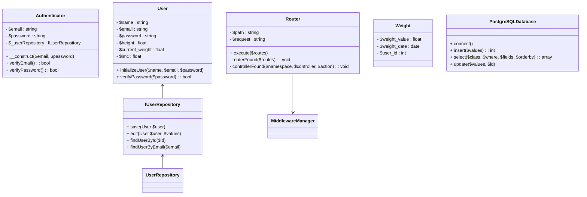

### Especificação Funcional

#### Contexto:

O sistema descrito é uma aplicação web desenvolvida em PHP baseada em um modelo de arquitetura MVC (Model-View-Controller). Ele utiliza conceitos de injeção de dependência e um container para gerenciar instâncias. A aplicação parece ter como objetivo principal gerenciar informações relacionadas ao peso e IMC (Índice de Massa Corporal) dos usuários.

---

### Funcionalidades Principais

#### 1. **Autenticação**
   - Utilizar autenticação baseada em email e senha.
   - Verifica se o email existe no banco de dados ao fazer login.
   - Verifica se a senha fornecida corresponde àquela armazenada no banco (hashing aplicado).

#### 2. **Sistema de Rotas**
   - Define rotas baseadas em métodos `GET` e `POST`.
   - Cada rota verifica o middleware relacionado antes de permitir o acesso.

#### 3. **Cadastro de Usuário**
   - Cadastro inicial de novos usuários fornecendo informações básicas (email, nome, altura, peso e senha).
   - Senhas são armazenadas com hashing. IMC é calculado no ato do registro.

#### 4. **Perfil do Usuário**
   - Permite atualizar as informações do usuário.
   - Suporte para atualização de senha.
   - Altura e outros dados podem ser modificados.

#### 5. **Gestão de Pesos**
   - Adicionar novos registros de peso.
   - Listar histórico de pesos (todos ou filtrados por mês).

#### 6. **Histórico e Classificação**
   - Apresenta informações como peso atual, IMC e classificação com base no IMC.
   - Mostra gráfico ou lista de histórico de pesos.

#### 7. **Middleware para Segurança**
   - Middleware `auth`: Verifica se o usuário está autenticado antes de permitir o acesso.
   - Middleware `logged`: Redireciona para a página inicial caso o usuário já esteja logado.

#### 8. **Serviços e Repositórios**
   - Implementação de serviços responsáveis por lógica de negócio, como LoginService, UserServices e WeightService.
   - Repositórios gerenciam acesso ao banco de dados.

---

### Fluxos de Utilização

1. **Fluxo de Cadastro:**
   - O usuário acessa a página `Registration`.
   - Preenche nome, email, senha, altura e peso.
   - O sistema verifica se os dados estão válidos e se já há algum registro com o email fornecido.
   - Caso o cadastro seja concluído: mostra mensagem de sucesso.
   - Caso falhe (como emails duplicados): exibe erro de validação.

2. **Fluxo de Login:**
   - Usuário acessa a página de login.
   - Insere email e senha.
   - O sistema verifica a validade do email e confere se a senha está correta.
   - Caso válido, o usuário é autenticado, e a sessão é iniciada.

3. **Fluxo de Modificação do Perfil:**
   - Usuário acessa a página de perfil.
   - Pode alterar informações como email, nome e altura. Adicionar nova senha, se necessário.
   - O sistema aplica as verificações, realiza a atualização no banco de dados e recalcula o IMC.

4. **Adição de Peso:**
   - Na página de "Adicionar Peso", insere o peso e a data.
   - O valor é armazenado no banco de dados associado ao usuário.

5. **Consulta ao Histórico:**
   - Usuário consulta histórico de pesos, podendo filtrá-los por mês ou então visualizar todos.

6. **Logout:**
   - Usuário clica em sair.
   - O middleware destrói a sessão e retorna à página de login.

#### Segurança
   - As senhas são armazenadas no banco de dados de forma criptografada usando a função `password_hash`.
   - O sistema utiliza middlewares para controle de acesso.
   - Sessões são utilizadas para gerenciamento de autenticação.

---

### Diagramas

#### 1. **Diagrama de Classes**
Relaciona classes principais e seus métodos.



---

#### 2. **Diagrama de Processo: Adicionar Peso**


---

#### 3. **Diagrama de Processo: Login**

```mermaid
flowchart TD
    A[Usuário insere email e senha] --> B[Submit Form POST /login]
    B --> C[Middleware verifica usuário autenticado]
    C --> D[Authenticator: verifica e-mail]
    D --> E{Email existe?}
    E -- Sim --> F[Authenticator: verifica senha]
    F --> G{Senha é válida?}
    G -- Sim --> H[Inicia sessão e redireciona para home]
    G -- Não --> I[Exibe mensagem: "Senha incorreta!"]
    E -- Não --> J[Exibe mensagem: "E-mail não encontrado!"]
```

---

### Requisitos Técnicos

1. **Banco de Dados**
   - PostgreSQL.
   - Estruturas para gerenciar usuários (`users`) e pesos (`weights`).

2. **Serviços**
   - Serviços como autenticação, armazenamento de pesos, etc.

3. **Middleware**
   - Garantir controle de autenticação e rotas apropriadas.

4. **Autenticador**
   - Fazer hashing e validação das senhas de forma segura.

5. **Container**
   - Utilização de containers para injeção de dependência.

--- 

### Observações
Os arquivos estão bem organizados, seguindo práticas adequadas para projetos MVC. Alguns pontos de melhorias podem ser considerados:
- Adicionar mais documentação para métodos das classes.
- Trabalhar com logs para monitorar erros e prevenções de falhas em ambientes de produção.
Will you like diagrams representing the flow for the entire application's features?