## Documentação de Software

### Resumo

Este sistema é uma aplicação web orientada a serviços para gerenciamento de peso e cálculo de IMC (Índice de Massa Corporal). Permite que os usuários possam se registrar, fazer login, adicionar seus pesos, visualizar o histórico de peso e o IMC atual. Utiliza um repositório PostgreSQL para armazenar os dados dos usuários e dos pesos registrados. A navegação na aplicação é gerenciada por um roteador, e a interface do usuário é composta por diversas views implementadas em PHP.

### Especificação Funcional

#### Classes e Módulos

1. **Authenticator**
   - Caminho do Arquivo: `src/app/classes/Authenticator.php`
   - Função: Gerencia a autenticação do usuário.
   - Métodos:
     - `__construct($email, $password)`: Inicializa com e-mail e senha fornecidos.
     - `verifyEmail()`: Verifica se o e-mail existe.
     - `verifyPassword()`: Verifica se a senha corresponde ao e-mail fornecido.

2. **Container**
   - Caminho do Arquivo: `src/app/classes/Container.php`
   - Função: Implementa um container de injeção de dependência.
   - Métodos:
     - `getInstance()`: Retorna a instância do container.
     - `set($key, $value)`: Registra uma instância no container.
     - `get($key)`: Recupera uma instância do container.

3. **Engine**
   - Caminho do Arquivo: `src/app/classes/Engine.php`
   - Função: Renderiza views e atualiza o usuário logado.
   - Métodos:
     - `updateLoggedInUser()`: Atualiza as informações do usuário logado na sessão.
     - `render(string $targetView, array $data)`: Renderiza a view fornecida.

4. **Hashing**
   - Caminho do Arquivo: `src/app/classes/Hashing.php`
   - Função: Implementa métodos de hash para criptografia de senhas.
   - Métodos:
     - `encrypt($password)`: Criptografa a senha.
     - `decrypt($password, $encrypt_password)`: Verifica a senha criptografada.

5. **MiddlewareManager**
   - Caminho do Arquivo: `src/app/classes/MiddlewareManager.php`
   - Função: Verifica o middleware antes de executar ações específicas.
   - Métodos:
     - `verify(string $middlewareType)`: Verifica o middleware especificado.

6. **Router**
   - Caminho do Arquivo: `src/app/classes/Router.php`
   - Função: Gerencia as rotas da aplicação.
   - Métodos:
     - `execute($routes)`: Executa a rota correspondente à requisição.

#### Controllers

1. **HomeController**
   - Caminho do Arquivo: `src/app/controllers/HomeController.php`
   - Função: Controla ações relacionadas à página inicial.
   - Métodos:
     - `index()`: Exibe a página inicial.
     - `filter()`: Filtra o histórico de pesos.

2. **LoginController**
   - Caminho do Arquivo: `src/app/controllers/LoginController.php`
   - Função: Controla ações de login e logout.
   - Métodos:
     - `index()`: Exibe a página de login.
     - `login()`: Efetua o login do usuário.
     - `logout()`: Efetua o logout do usuário.

3. **UserController**
   - Caminho do Arquivo: `src/app/controllers/UserController.php`
   - Função: Controla ações de registro e perfil de usuários.
   - Métodos:
     - `registration()`: Exibe a página de registro.
     - `profile()`: Exibe o perfil do usuário.
     - `create()`: Cria um novo usuário.
     - `update()`: Atualiza as informações do usuário.

4. **WeightController**
   - Caminho do Arquivo: `src/app/controllers/WeightController.php`
   - Função: Controla ações relacionadas ao peso dos usuários.
   - Métodos:
     - `create()`: Exibe a página de criação de peso.
     - `store()`: Armazena um novo peso no banco de dados.

#### Models

1. **User**
   - Caminho do Arquivo: `src/app/models/User.php`
   - Função: Representa o modelo do usuário.
   - Métodos:
     - `initializeUser()`: Inicializa o usuário com dados fornecidos.
     - `verifyPassword()`: Verifica a senha.
     - Getters e setters para os atributos do usuário.

2. **Weight**
   - Caminho do Arquivo: `src/app/models/Weight.php`
   - Função: Representa o modelo do peso.
   - Métodos:
     - `initializeWeight()`: Inicializa o peso com dados fornecidos.
     - Getters e setters para os atributos do peso.

#### Banco de Dados

1. **DbConnection**
   - Caminho do Arquivo: `src/app/database/DbConnection.php`
   - Função: Classe abstrata para conexão de banco de dados.
   - Métodos:
     - `connect()`: Método abstrato para conectar ao banco de dados.

2. **IPostgreSQLDatabase**
   - Caminho do Arquivo: `src/app/database/IPostgreSQLDatabase.php`
   - Função: Interface para banco de dados PostgreSQL.
   - Métodos:
     - `insert()`
     - `select()`
     - `update()`
     - `setTable()`

3. **PostgreSQLDatabase**
   - Caminho do Arquivo: `src/app/database/PostgreSQLDatabase.php`
   - Função: Implementa a interface de banco de dados PostgreSQL.
   - Métodos:
     - `connect()`: Conecta ao banco de dados PostgreSQL.
     - Métodos definidos na interface `IPostgreSQLDatabase`.

4. **IUserRepository**
   - Caminho do Arquivo: `src/app/database/IUserRepository.php`
   - Função: Interface para repositório de usuários.
   - Métodos:
     - `save(User $user)`
     - `edit(User $user, $values)`
     - `findUserById($id)`
     - `findUserByEmail($email)`

5. **UserRepository**
   - Caminho do Arquivo: `src/app/database/UserRepository.php`
   - Função: Implementa a interface de repositório de usuários.
   - Métodos:
     - `save(User $user)`: Salva o usuário no banco de dados.
     - `edit(User $user, $values)`: Edita o usuário no banco de dados.
     - `findUserById($id)`: Busca o usuário por ID.
     - `findUserByEmail($email)`: Busca o usuário por e-mail.

6. **IWeightRepository**
   - Caminho do Arquivo: `src/app/database/IWeightRepository.php`
   - Função: Interface para repositório de pesos.
   - Métodos:
     - `save(Weight $weight)`
     - `fetchAllByUserId($user_id)`
     - `fetchByMonthAndUser_id($month, $user_id)`

7. **WeightRepository**
   - Caminho do Arquivo: `src/app/database/WeightRepository.php`
   - Função: Implementa a interface de repositório de pesos.
   - Métodos:
     - `save(Weight $weight)`: Salva o peso no banco de dados.
     - `fetchAllByUserId($user_id)`: Busca os pesos pelo ID do usuário.
     - `fetchByMonthAndUser_id($month, $user_id)`: Busca os pesos pelo mês e ID do usuário.

#### Serviços

1. **ILoginService**
   - Caminho do Arquivo: `src/app/services/ILoginService.php`
   - Função: Interface para serviço de login.
   - Métodos:
     - `login($_post)`
     - `logout()`

2. **IUserService**
   - Caminho do Arquivo: `src/app/services/IUserService.php`
   - Função: Interface para serviço de usuários.
   - Métodos:
     - `create($_post)`
     - `update($_post, $user_id)`

3. **IWeightService**
   - Caminho do Arquivo: `src/app/services/IWeightService.php`
   - Função: Interface para serviço de pesos.
   - Métodos:
     - `store($_post, $user_id)`

4. **LoginService**
   - Caminho do Arquivo: `src/app/services/LoginService.php`
   - Função: Implementa a interface de serviço de login.
   - Métodos:
     - `login($_post)`: Realiza o login do usuário.
     - `logout()`: Realiza o logout do usuário.

5. **UserService**
   - Caminho do Arquivo: `src/app/services/UserServices.php`
   - Função: Implementa a interface de serviço de usuários.
   - Métodos:
     - `create($_post)`: Cria um novo usuário.
     - `update($_post, $user_id)`: Atualiza as informações do usuário.

6. **WeightService**
   - Caminho do Arquivo: `src/app/services/WeightService.php`
   - Função: Implementa a interface de serviço de pesos.
   - Métodos:
     - `store($_post, $user_id)`: Armazena um novo peso.

#### View
- **Home**
   - Caminho do Arquivo: `src/app/views/home.php`
   - Exibe a página inicial com o peso atual, IMC e histórico de pesos.
- **Login**
   - Caminho do Arquivo: `src/app/views/login.php`
   - Exibe a página de login.
- **Profile**
   - Caminho do Arquivo: `src/app/views/profile.php`
   - Exibe a página de perfil do usuário.
- **Registration**
   - Caminho do Arquivo: `src/app/views/registration.php`
   - Exibe a página de cadastro de novos usuários.
- **Weight**
   - Caminho do Arquivo: `src/app/views/weight.php`
   - Exibe a página para adicionar novos pesos.

#### Helpers

1. **config**
   - Caminho do Arquivo: `src/app/helpers/config.php`
   - Função: Configura o container de injeção de dependências.

2. **helpers**
   - Caminho do Arquivo: `src/app/helpers/helpers.php`
   - Função: Contém funções auxiliares para a aplicação.
   
#### Rotas

- Caminho do Arquivo: `src/app/routes/routes.php`
- Descreve as rotas disponíveis na aplicação.

### Diagramas

#### Diagrama de Classes

```mermaid
classDiagram
    class Authenticator {
        - $email
        - $password
        - $_userRepository
        + __construct($email, $password)
        + verifyEmail()
        + verifyPassword()
    }

    class Container {
        - $instances
        - $instance
        + getInstance()
        + set($key, $value)
        + get($key)
    }

    class Engine {
        + updateLoggedInUser()
        + render($targetView, $data)
    }

    class Hashing {
        + encrypt($password)
        + decrypt($password, $encrypt_password)
    }

    class MiddlewareManager {
        + verify($middlewareType)
    }

    class Router {
        - $path
        - $request
        + execute($routes)
    }

    class HomeController {
        + index()
        + filter()
    }

    class LoginController {
        - $_loginService
        + __construct($_loginService)
        + index()
        + login()
        + logout()
    }

    class UserController {
        - $_userService
        + __construct($_userService)
        + registration()
        + profile()
        + create()
        + update()
    }

    class WeightController {
        - $_weightService
        + __construct($_weightService)
        + create()
        + store()
    }

    class User {
        - $id
        - $name
        - $email
        - $password
        - $height
        - $current_weight
        - $imc
        + initializeUser($name, $email, $password, $height, $current_weight)
        + verifyPassword($password)
        + removePassword()
        + getId()
        + getName()
        + getEmail()
        + getHeight()
        + getPassword()
        + setId($id)
        + getImc()
    }

    class Weight {
        - $id
        - $weight_value
        - $weight_date
        - $user_id
        + initializeWeight($weight_value, $weight_date, $user_id)
        + getWeight_value()
        + getWeight_date()
        + getUser_id()
        + setId($id)
    }

    class DbConnection {
        # $table
        # $connection
        # connect()
    }

    class IPostgreSQLDatabase {
        <<interface>>
        + insert($values)
        + select($class, $where, $fields, $orderby)
        + update($values, $id)
        + setTable($table)
    }

    class PostgreSQLDatabase {
        + __construct()
        + connect()
    }

    class IUserRepository {
        <<interface>>
        + save(User $user)
        + edit(User $user, $values)
        + findUserById($id)
        + findUserByEmail($email)
    }

    class UserRepository {
        + save(User $user)
        + findUserById($id)
        + findUserByEmail($email)
    }

    class IWeightRepository {
        <<interface>>
        + save(Weight $weight)
        + fetchAllByUserId($user_id)
        + fetchByMonthAndUser_id($month, $user_id)
    }

    class WeightRepository {
        + save(Weight $weight)
        + fetchAllByUserId($user_id)
        + fetchByMonthAndUser_id($month, $user_id)
    }

    class ILoginService {
        <<interface>>
        + login($_post)
        + logout()
    }

    class IUserService {
        <<interface>>
        + create($_post)
        + update($_post, $user_id)
    }

    class IWeightService {
        <<interface>>
        + store($_post, $user_id)
    }

    class LoginService {
        + login($_post)
        + logout()
    }

    class UserServices {
        + create($_post)
        + update($_post, $user_id)
    }

    class WeightService {
        + store($_post, $user_id)
    }
```

### Conclusão

Esta documentação apresentou uma visão geral do sistema, detalhando suas classes principais, controladores, modelos, repositórios, serviços e definições de rotas. Implementa-se principalmente a arquitetura MVC (Model-View-Controller), adicionando-se a facilidade de injeção de dependências e auxílio de middleware para controle de acesso.
